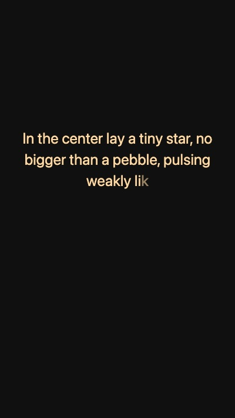

# Bedtime

### Fall asleep by watching JavaScript load

This little toy project progressively tells a bedtime story about Liora and its little companion, while intentionally making a JavaScript loader spin for no reason other than to help you get to sleep.

As you go through the story, the time the loader spins increases while the speed at which the text appears decreases, so that you ideally never reach the end (unless you really, really want to).

I came up with this one night when I couldn’t fall asleep and was looking for some data analysis results on a web platform, noticing that the spinner was actually making me sleepy.

I am using it from time to time, and it helps a bit. So I decided to make it public. Here it is! You can try it directly at [http://bedtime.my](http://bedtime.my).

If you add it to your phone’s home screen, it should display fullscreen.

  
  
  

